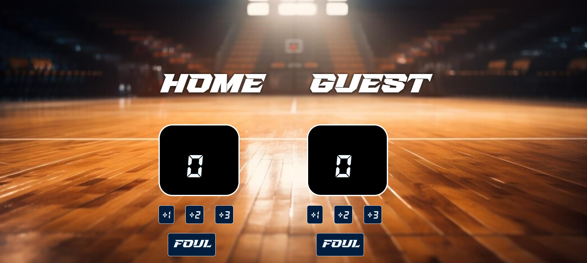

# Basketball Points Counter WebApp

## Overview
This is a simple web application that allows users to keep track of basketball points. The app is built using **HTML, CSS, and JavaScript**.

## Features
- Add points for Team A and Team B.
- Foul to -1 
- Simple and interactive UI.

## Technologies Used
- **HTML**: Structure of the web app.
- **CSS**: Styling for better appearance.
- **JavaScript**: Handles user interactions and score updates.

## How to Use
1. Open `index.html` in a web browser.
2. Click the buttons to add points to Team A or Team B.
3. Click the "foul" button to negative scores.

## File Structure
```
/ Basketball-Points-Counter
│── index.html    # Main HTML file
│── index.css    # CSS file for styling
│── script.js     # JavaScript file for functionality
```              

## Preview         
         

## Web link 

[View Page](https://basketballpoints.netlify.app/)
